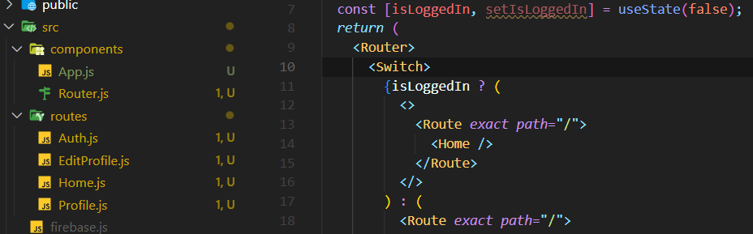
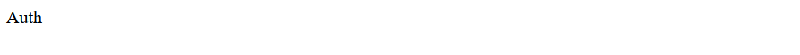
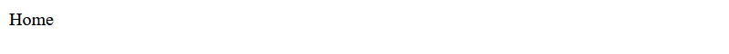

# 03_Router Setup

##### ◼ react-router-dom  설치

```bash
npm i react-router-dom@5.3.0
```




##### ◼ `Router.js`

```js
import React, { useState } from "react";
import { HashRouter as Router, Route, Switch } from "react-router-dom";
import Auth from "../routes/Auth";
import Home from "../routes/Home";

const AppRouter = () => {
  const [isLoggedIn, setIsLoggedIn] = useState(false);
  return (
    <Router>
      <Switch>
        {isLoggedIn ? (
          <>
            <Route exact path="/">
              <Home />
            </Route>
          </>
        ) : (
          <Route exact path="/">
            <Auth />
          </Route>
        )}
      </Switch>
    </Router>
  );
};
export default AppRouter;
```


##### 🤔 Fragment? 

> 많은 요소들을 render 하고 싶을 때 사용한다. 


---

```
useState(false);
```



```
useState(true);
```



---


