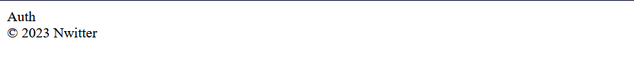
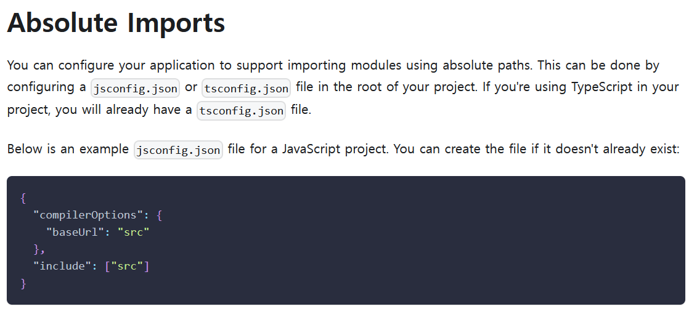

# 01_Using Firebase Auth

##### ◼ App.js

```js
function App() {
  const [isLoggedIn, setIsLoggedIn] = useState(false);
  return (
    <>
      <AppRouter isLoggedIn={isLoggedIn} />
      <footer>&copy; {new Date().getFullYear() } Nwitter</footer> 
    </>  
  );
}
```



##### ◼ Absolute Imports



> ```
> 절대 경로를 사용하여 모듈 가져오기를 지원하도록 애플리케이션을 구성할 수 있습니다. 이것은 프로젝트의 루트에서 jsconfig.json 또는 tsconfig.json 파일을 구성하여 수행할 수 있습니다. 프로젝트에서 TypeScript를 사용하고 있다면 이미 tsconfig.json 파일이 있을 것입니다.
> 
> 다음은 JavaScript 프로젝트에 대한 예제 jsconfig.json 파일입니다. 아직 존재하지 않는 경우 파일을 만들 수 있습니다.
> ```


##### ◼ `jsconfig.json` 파일 생성 및 코드 작성 

```json
{
    "compilerOptions": {
      "baseUrl": "src"
    },
    "include": ["src"]
  }
```


---


## 🔍 getAuth()

> 제공된 FirebaseApp 과 연결된 인증 인스턴스를 반환한다. 
>
> 인스턴스가 없으면 플랫폼별 기본 종속성을 사용하여 인증 인스턴스를 초기화한다. 

```js
export declare function getAuth(app?: FirebaseApp): Auth;
```

