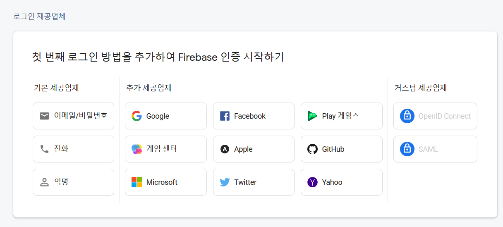
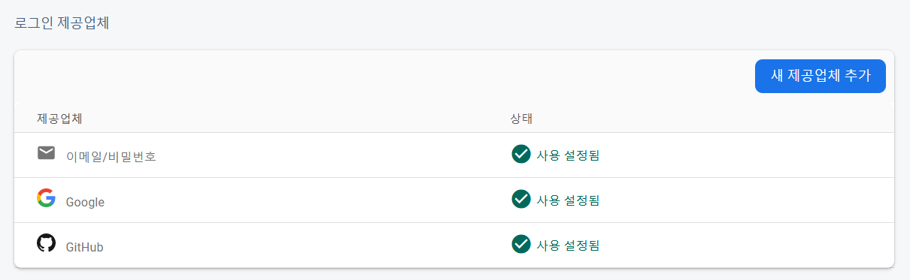
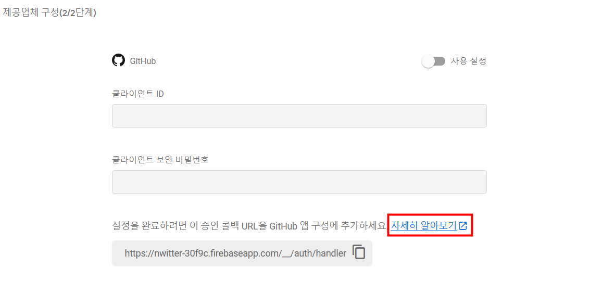
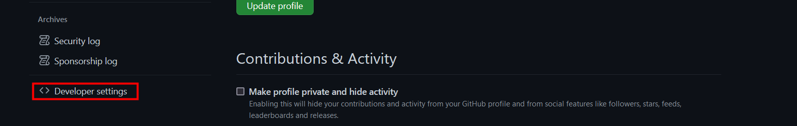
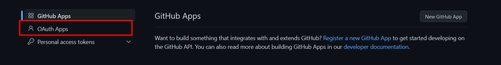
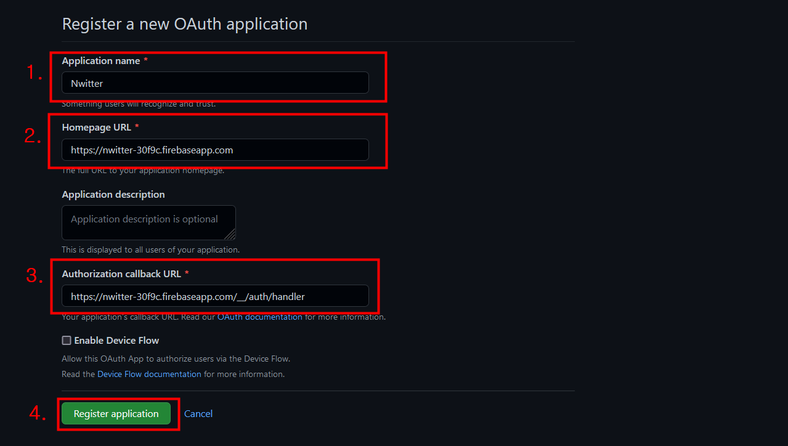
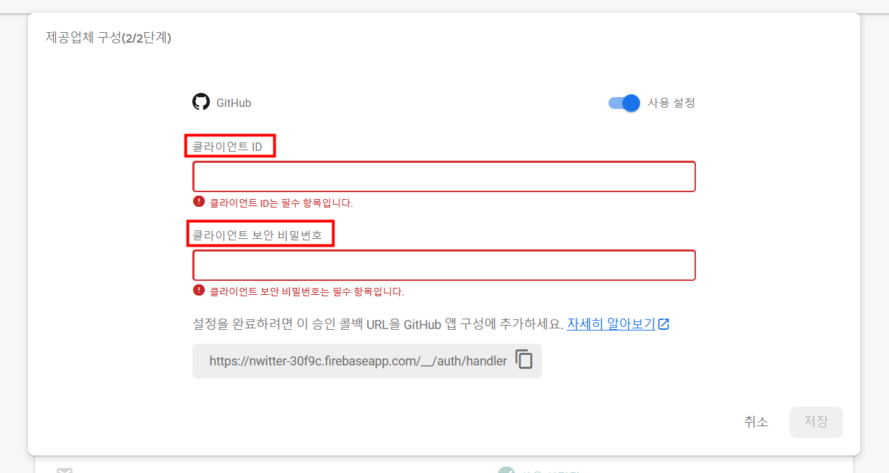
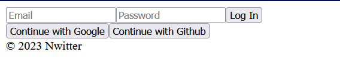

# 02_Login Form part One


> 확인할 수 있는 옵션들이 많다





> 이메일과 구글은 쉽게 추가하여 저장할 수 있다. 


##### 🔍 GitHub일 경우 

##### (1) 자세히 알아보기 



##### (2) GitHub settings > developer settings 




##### (3) OAuth APPS





> 이후 Client ID가 발급이 된다. 


##### (4) 클라이언트 ID와 클라이언트 보안 비밀번호 > 저장



> 클라이언트 ID와 클라이언트 보안 비밀번호를 각각 입력해준다. 


---


### ◼ Auth.js

```js
import React from "react";

const Auth = () => <div>
    <form>
        <input type="text" placeholder="Email" required />
        <input type="password" placeholder="Password" required />
        <input type="submit" value="Log In" />
    </form>
    <div>
        <button>Continue with Google</button>
        <button>Continue with Github</button>
    </div>
</div>;

export default Auth;
```




---


```js
import React, { useState } from "react";

const Auth = () => {
    const [email, setEmail] = useState("");
    const [password, setPassword] = useState("");
    // onChange function 
    const onChange = (event) => {
        // 간단하게 form을 컨트롤 할 수 있는 방법 
        const {
            target: { name, value },
        } = event;
        if ( name === "email" ) {
            setEmail(value);
        }else if (name === "password") {
            setPassword(value);
        }
    };
    // onSubmit _ form 제출에 대해서 preventDefault를 하도록 하기
    const onSubmit = (event) => {
        event.preventDefault();
    };

    return (
        <div>
            <form onSubmit={onSubmit}>
                <input 
                    name="email" 
                    type="text" 
                    placeholder="Email" 
                    required 
                    value={email}
                    onChange={onChange}
                />
                <input 
                    type="password" 
                    name="password" 
                    placeholder="Password" 
                    required 
                    value={password}
                    onChange={onChange}
                />
                <input type="submit" value="Log In" />
            </form>
            <div>
                <button>Continue with Google</button>
                <button>Continue with Github</button>
            </div>
        </div>
    );
};


export default Auth;
```

